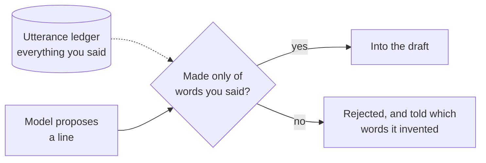
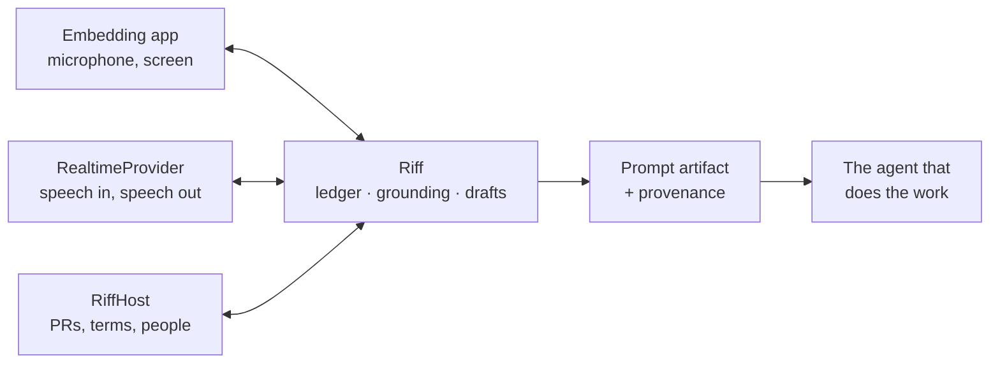

# Riff

Riff is a voice agent that turns thinking out loud into a finished prompt for another agent — in
the speaker's own words, without them ever having to read it back or edit it.

You talk. Riff listens, asks the occasional question, quietly looks up the things you pointed at
instead of naming, and assembles a prompt out of sentences you actually said. When you say "send
it," it goes.

## A session, start to finish

> **You** — okay so the export button on the dashboard, it does nothing if you've got more than
> about a thousand rows. just spins.
>
> **You** — and it's related to the PR I just opened I think
>
> **Riff** — that's 412, chunked uploads.
>
> **You** — yeah that one. um, and don't touch the generated files, you know how it is
>
> **You** — I should be able to export like fifty thousand rows without it falling over. send it.

That one line is the only time Riff speaks. Everything else — capturing, drafting, resolving 412,
recognizing a standing instruction it had saved before — happens without interrupting you. Here is
what it sent:

```markdown
# Fix the export button

the export button on the dashboard does nothing if you've got more than about a thousand rows.
just spins. it's related to the PR I just opened.

**Constraints**
- don't touch the generated files

**Done when**
- I should be able to export like fifty thousand rows without it falling over

**Context**
- acme/web#412 "Chunked uploads" (open) — https://github.com/acme/web/pull/412 — referred to as
  "the PR I just opened"
```

Three things to notice:

- **Every sentence in the body is one you said.** Filler and false starts are gone, and nothing was
  rephrased. "just spins" survived, because it is a real diagnostic detail that a rewriter would
  have dropped as informal.
- **The reference was resolved; the sentence was not.** The body still says "the PR I just opened."
  The context block says which PR that is. The downstream agent gets both.
- **The constraint arrived in your words**, from a standing instruction Riff saved earlier — not
  from a policy Riff invented.

## Why Riff

Most of the time now, building software means writing prompts. The agent does the work; you decide
what the work is. That makes the prompt the highest-leverage thing you produce in a day, and it is
produced under worse conditions than any other artifact you make.

| | |
|---|---|
| **Typing is the bottleneck** | Speech is three times faster, and it is how you already think. But the voice workflow today is recite, proofread, restructure — and the editing gives back everything the speed gained. |
| **The agent is silent when it could help most** | It cannot ask "which repo?" until after you have finished and sent. |
| **Recognition breaks on the words that matter** | Ordinary English transcribes fine. Repo names, services, acronyms, colleagues — the load-bearing nouns of a technical request — come out as "get hub." |
| **Context you should not have to fetch** | Every request points at something. Either you stop mid-thought to find the number and the URL, or you leave it vague and the downstream agent burns time working out what you meant, sometimes wrongly. |
| **You repeat yourself constantly** | "Don't touch the generated files." Retyped into prompt after prompt, and forgotten in exactly the ones where it mattered. |
| **Prompting is iterative; the tools are one-shot** | Ideas get worked out across several drafts. There is nowhere to park a half-finished prompt. |

And the obvious fix makes it worse. Hand the transcript to a model and ask it to "clean this up" and
you get a well-organized prompt that is no longer yours — hedges gone, emphasis gone, your specific
weird word for the thing swapped for a more standard one. Intent lives in that specificity. A prompt
that reads better and means something slightly different is a worse prompt, and it fails silently,
because you stopped reading it.

## How "their words" is enforced

Instructing a model to preserve someone's voice does not work reliably. Models paraphrase; it is
close to the core of what they do. So in Riff it is not an instruction, it is a gate.



The only permitted edit is *deletion* — drop filler, drop a false start, drop a whole sentence, fix
a word the transcriber got wrong. A rejection names the invention:

```
they did not say "csv", "functionality", "silently"; use their words or ask them
```

The model then puts your words back, or asks. You see none of this. Two consequences:

- **Fidelity is a number**, not a claim — the token-weighted share of the prompt that is provably
  yours, carried on every artifact, so a consumer can tell whether a prompt was captured or composed
  without reading it.
- **The property survives model swaps.** A chattier model produces the same guarantee, because the
  guarantee does not live in the prompt.

<details>
<summary>How the check actually works</summary>

Because deletion is the only permitted edit, a legitimate line is an ordered subsequence of
something the speaker said — which a longest-common-subsequence comparison measures directly.
Order-sensitivity matters: it also catches words shuffled inside a sentence, which reads as a
rewrite even when every word is theirs. Lexicon corrections are applied to both sides of every
comparison, so an alias can never make a paraphrase look grounded.

Full algorithm and edge cases: [docs/grounding.md](docs/grounding.md).

</details>

## Goals

- **Faithful.** The prompt body is your words. Fidelity is measured, not asserted.
- **Finished.** The output is submittable as-is. No proofread step, no edit step.
- **Out of the way.** Riff asks only when the answer changes what the downstream agent does, and
  gives feedback only when asked.
- **Resolved.** References, links, prior prompts, and domain vocabulary are looked up during the
  conversation rather than left for the downstream agent.
- **Interruptible.** Backtracking, corrections, tangents, and talking over the agent are normal
  input, not error cases.
- **Portable.** One shared agent definition, one shared engine contract, native bindings per
  platform, and a conformance suite that proves they agree.

## Non-goals

- **Riff does not do the work.** No implementation, design, library, file to change, or sequence of
  steps, and it will not write code. That belongs to the agent downstream, and the boundary is what
  keeps Riff from becoming a second, worse coding agent.
- **Riff does not improve your prompt.** It will not make you sound more professional, more
  technical, or more concise. It captures; it does not edit.
- **Riff is not a chat interface.** It has no opinion on your idea and does not want to discuss it.
- **Riff does not decide when to send.** No auto-submit, and the configuration that would enable one
  is rejected at load time.
- **Riff is not an app.** It is a library, embedded into applications that supply the microphone, the
  screen, and the world it looks things up in.

## Architecture

Two seams, and everything interesting sits between them.



| Seam | What it hides |
|---|---|
| **`RealtimeProvider`** | Everything that produces speech: move audio, report what was heard, relay tool calls. Nothing above it knows any provider's wire format, which is what lets the speech engine change without changing a single thing a speaker can observe. |
| **`RiffHost`** | Everything world-shaped: what "the PR I just opened" refers to, what an acronym means here, what you asked for last week, where a finished prompt goes. Riff knows how to keep a prompt in your voice; it does not know what your world contains. This is why the same agent works in an editor, a terminal, a phone, and a design tool. |

Between them sits the part that is genuinely Riff — the ledger, the grounding check, drafts, takes,
and the artifact. That layer is implemented natively per platform and held to a shared conformance
suite.

The **agent definition** — instructions, tool contracts, session defaults, seed lexicon — lives in
`core/agent` as plain files and compiles to a single bundle every binding loads. Changing how Riff
behaves is a change to markdown and JSON, not to Swift and TypeScript in parallel.

More in [docs/architecture.md](docs/architecture.md).

<details>
<summary>Repository layout</summary>

```
core/
  agent/           the shared agent: instructions, tool contracts, session defaults, seed lexicon
  schema/          JSON Schema for the manifest and the prompt artifact
  conformance/     cases every binding must reproduce, as data
  dist/            compiled agent bundle (generated, committed)
packages/
  riff-core/            engine: ledger, grounding, drafts, tools, session
  riff-openai-realtime/ OpenAI Realtime provider (WebSocket and WebRTC)
  riff-github/          GitHub-backed host: resolves PRs, issues, commits, people
swift/
  Sources/RiffCore/            the same engine, natively
  Sources/RiffOpenAIRealtime/  the same provider, over URLSessionWebSocketTask
  Sources/RiffAudio/           capture and playback, including the echo cancellation setup
tools/
  build-bundle.mjs   compiles core/agent into the bundle each binding ships
docs/
```

</details>

## Ideas worth naming

- **Utterance ledger** — append-and-revise record of everything said. The only thing the prompt body
  may draw from.
- **Grounding check** — the gate described above. Configurable per section; strict everywhere by
  default.
- **Takes** — a session holds several drafts. Change subject and Riff parks the old one instead of
  destroying it. Come back to it later.
- **Motifs** — standing instructions saved once, in your own words, and reattached when they apply.
  Because they are captured verbatim, reuse cannot flatten anyone's voice.
- **Lexicon** — domain vocabulary transcription gets wrong. Feeds transcription biasing at connect
  time, and lets the grounding check see that a mangled transcription and the real term are the same
  word. Grows as the agent learns.
- **Prompt artifact** — the output, carrying the rendered prompt, the resolved context, the terms
  used, and provenance including the fidelity score. Schema in
  [`core/schema/prompt-artifact.schema.json`](core/schema/prompt-artifact.schema.json).

## Getting started

```bash
npm install && npm run build && npm test   # TypeScript
swift test --package-path swift            # Swift
```

<details>
<summary>Wiring a session in TypeScript</summary>

```ts
import { loadBundle, RiffSession } from "@riff/core";
import { OpenAIRealtimeProvider, clientSecretCredentials } from "@riff/openai-realtime";
import { GitHubHost, issueDestination } from "@riff/github";
import bundleJson from "./core/dist/riff-agent.bundle.json" with { type: "json" };

const session = new RiffSession({
  bundle: loadBundle(bundleJson),
  provider: new OpenAIRealtimeProvider({
    // Your backend mints this. A long-lived API key never reaches a client.
    credentials: clientSecretCredentials(() => fetch("/api/riff/token").then((r) => r.json())),
  }),
  host: new GitHubHost({
    token: process.env.GITHUB_TOKEN!,
    repository: "acme/web",
    destinations: [issueDestination({ repository: "acme/web", default: true })],
  }),
});

session.on((event) => {
  if (event.type === "agent.audio") speaker.play(event.audio);
  if (event.type === "draft") ui.showDraft(event.gist, event.fidelity);
  if (event.type === "submitted") ui.confirm(event.artifact);
});

await session.start();
microphone.on("chunk", (pcm) => session.sendAudio(pcm));
```

</details>

<details>
<summary>Wiring a session in Swift</summary>

```swift
import RiffCore
import RiffOpenAIRealtime
import RiffAudio

let session = RiffSession(
    bundle: try AgentBundle.bundled(),
    provider: OpenAIRealtimeProvider(
        credentials: .clientSecret { try await backend.mintRiffToken() }
    ),
    host: myHost
)

let audio = RiffAudioEngine()
audio.onCapture = { pcm in Task { @MainActor in session.send(audio: pcm) } }

try await session.start()
try audio.start()

for await event in session.events {
    switch event {
    case .agentAudio(let pcm): audio.play(pcm)
    case .interrupted: audio.flushPlayback()
    case .draft(_, let ready, let fidelity, let gist): ui.show(gist, ready, fidelity)
    case .submitted(let artifact): ui.confirm(artifact)
    default: break
    }
}
```

Hold a strong reference to the session for as long as it is connected. Releasing it tears the
connection down, by design — a half-live session with an open microphone is worse than a closed one.

</details>

## Testing

```bash
npm test                          # 97 tests: engine, provider, host, conformance
swift test --package-path swift   # the same conformance suite, natively
```

The cases in [`core/conformance`](core/conformance) are data, not code, and both implementations
execute them. They pin what has to be identical everywhere: which lines are grounded, which are
rejected, and the exact bytes a finished prompt renders to. A prompt captured on a phone and one
captured at a desk come out the same. `npm test` also fails if the committed agent bundle has
drifted from `core/agent`, so the definition Swift ships can never fall behind the one TypeScript
ships.

See [docs/conformance.md](docs/conformance.md) for how to add a binding.

## Security and privacy

- **No long-lived credential on a client.** Devices connect with ephemeral secrets minted by your
  backend. `mintClientSecret` is the only part of the provider that must stay server-side.
- **Audio is not persisted.** Riff keeps transcripts, because the prompt is built from them; it does
  not keep the recording.
- **Credentials are stripped from transcripts** before anything is stored — tokens and API keys that
  arrive through typed input never reach the ledger, the draft, or the model.
- **Nothing is fetched that was not referred to.** Riff resolves references through the host and
  records links; it does not crawl.

Details and the threat model in [docs/security.md](docs/security.md).

## Documentation

| | |
|---|---|
| [Agent design](docs/agent-design.md) | The behavioral contract, and why each rule is there |
| [Architecture](docs/architecture.md) | Layers, session lifecycle, data flow |
| [Grounding](docs/grounding.md) | How "their words" is enforced, and where the edges are |
| [Prompt artifact](docs/prompt-artifact.md) | The output contract and its provenance |
| [Host bridge](docs/host-bridge.md) | Implementing a host for your world |
| [Providers](docs/providers.md) | The provider interface, OpenAI mapping, swapping engines |
| [Conformance](docs/conformance.md) | The shared suite, and adding a platform binding |
| [Security](docs/security.md) | Credentials, redaction, data handling |

## License

MIT. See [LICENSE](LICENSE).
