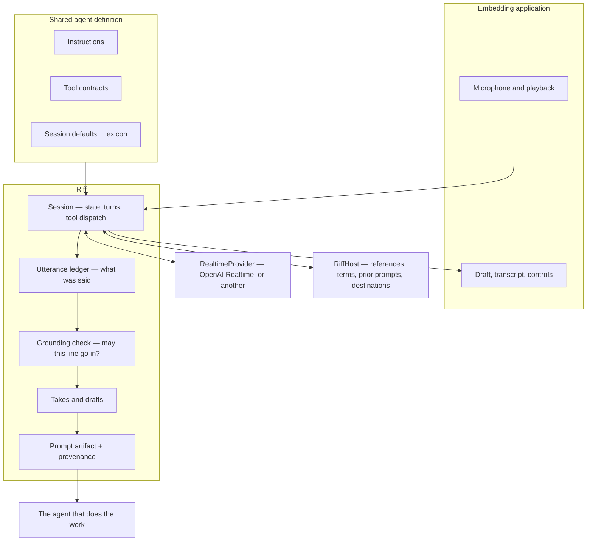

# Riff

Riff is a voice agent that turns thinking out loud into a finished prompt for another agent — in
the speaker's own words, without them ever having to read it back or edit it.

You talk. Riff listens, asks the occasional question, quietly looks up the things you pointed at
instead of naming, and assembles a prompt out of sentences you actually said. When you say "send
it," it goes.

---

## The problem

Most of the time now, building software means writing prompts. The agent does the work; the person
decides what the work is. That makes the prompt the highest-leverage thing a person produces in a
day, and it is produced under worse conditions than any other artifact they make.

**Typing is the bottleneck, and voice does not fix it yet.** Speaking is three times faster than
typing and it is how people already think through a problem. But the current voice workflow is:
recite a monologue, read the transcript, fix what the recognizer got wrong, restructure it because
speech is not prose, then submit. The proofreading and editing give back everything the speed
gained. Worse, the agent on the other side is silent during the part where it could help most — it
cannot ask "which repo?" until after you have finished and sent.

**Speech recognition breaks on exactly the words that matter.** Ordinary English transcribes fine.
Product names, repo names, service names, acronyms, and colleagues' names — the load-bearing nouns
of a technical request — come out as "get hub," "flake guard," "sequel." These are the words the
downstream agent needs most and the ones the transcript is least likely to get right.

**Half the effort goes into context the person should not have to fetch.** A request usually points
at something: the PR they just opened, the issue someone filed, the doc from Monday. Either the
person stops mid-thought to go find the number and the URL, or they leave it vague — "the PR I just
opened" — and the downstream agent burns time and tokens working out what that meant, sometimes
wrongly.

**People repeat themselves constantly.** "Don't touch the generated files." "Small PRs." "Run the
linter before you're done." The same standing instructions get retyped into prompt after prompt, and
get forgotten in exactly the prompts where they mattered.

**Prompting is iterative, and the tools treat it as one-shot.** Ideas get worked out across several
drafts. People want to start one prompt, park it, start another, come back. There is nowhere to put
a half-finished prompt.

And underneath all of it: **the obvious fix makes things worse.** Handing the transcript to a model
and asking it to "clean this up" produces a well-organized prompt that is no longer the person's.
Their hedges are gone, their emphasis is gone, their specific weird word for the thing has been
replaced by a more standard one. Intent lives in that specificity. A prompt that reads better and
means something slightly different is a worse prompt, and it fails silently — the person never sees
what was lost, because they stopped reading it.

## What Riff does instead

A short session, start to finish:

> **You** — okay so the export button on the dashboard, it does nothing if you've got more than
> about a thousand rows. just spins.
>
> **Riff** — *(silent; captures it, starts a draft)*
>
> **You** — and it's related to the PR I just opened I think
>
> **Riff** — that's 412, chunked uploads.
>
> **You** — yeah that one. um, and don't touch the generated files, you know how it is
>
> **Riff** — *(recognizes a standing instruction it has heard before, attaches it)*
>
> **You** — I should be able to export like fifty thousand rows without it falling over. send it.

What gets submitted:

```markdown
# Fix the export button

the export button on the dashboard does nothing if you've got more than about a thousand rows.
just spins. it's related to the PR I just opened.

**Constraints**
- don't touch the generated files

**Done when**
- I should be able to export like fifty thousand rows without it falling over

**Context**
- acme/web#412 "Chunked uploads" (open) — https://github.com/acme/web/pull/412 — referred to as
  "the PR I just opened"
```

Three things to notice.

**Every sentence in the body is one the speaker said.** Filler and false starts are gone. Nothing
was rephrased. "just spins" survived, because that is a real diagnostic detail and a rewriter would
have dropped it as informal.

**The reference was resolved but the sentence was not.** The body still says "the PR I just opened,"
because that is what they said. The context block says which PR that is. The downstream agent gets
both.

**The constraint arrived in their words**, from a standing instruction Riff had saved earlier, not
from a policy Riff invented.

## How "their words" is enforced

Instructing a model to preserve someone's voice does not work reliably. Models paraphrase; it is
close to the core of what they do. So in Riff it is not an instruction, it is a gate.

Everything the speaker says is recorded in an append-only **utterance ledger**. When the agent wants
to add a line to the prompt it proposes the text, and the engine checks that line against the
ledger before it is allowed in. The permitted edit is *deletion*: drop filler, drop a false start,
drop a whole sentence, fix a word the transcriber got wrong. That means a legitimate line is an
ordered subsequence of something the speaker actually said, which a longest-common-subsequence
comparison measures directly — and because it is order-sensitive, it also catches words being
shuffled inside a sentence, which reads as a rewrite even when every word is theirs.

Lines that fail are rejected, and the rejection tells the model which words it invented:

```
they did not say "csv", "functionality", "silently"; use their words or ask them
```

The model then puts their words back, or asks. The speaker sees none of this.

Two consequences worth calling out. Fidelity becomes a **number** — the token-weighted share of the
prompt that is provably the speaker's — carried on every artifact, so a consumer can tell whether a
prompt was captured or composed without reading it. And the property survives model swaps: a
different, chattier model produces the same guarantee, because the guarantee is not in the prompt.

See [docs/grounding.md](docs/grounding.md) for the algorithm and its edge cases.

## Goals

- **Faithful.** The prompt body is the speaker's words. Fidelity is measured, not asserted.
- **Finished.** The output is submittable as-is. No proofread step, no edit step.
- **Out of the way.** Riff asks only when the answer changes what the downstream agent does, and
  gives feedback only when asked.
- **Resolved.** References, links, prior prompts, and domain vocabulary are looked up during the
  conversation rather than left for the downstream agent.
- **Interruptible.** Backtracking, corrections, tangents, and talking over the agent are normal
  input, not error cases.
- **Portable.** One shared agent definition, one shared engine contract, native bindings per
  platform, and a conformance suite that proves they agree.

## Non-goals

- **Riff does not do the work.** It never proposes an implementation, a design, a library, a file to
  change, or a sequence of steps, and it will not write code. That belongs to the agent downstream.
  This boundary is the difference between a prompting tool and a second, worse coding agent.
- **Riff does not improve your prompt.** It will not make you sound more professional, more
  technical, or more concise. It captures; it does not edit.
- **Riff is not a chat interface.** It has no opinion on your idea and does not want to discuss it.
- **Riff does not decide when to send.** There is no auto-submit, and the configuration that would
  enable one is rejected at load time.
- **Riff is not an app.** It is a library, embedded into applications that supply the microphone,
  the screen, and the world it looks things up in.

## Architecture

Two seams, and everything interesting sits between them.



**`RealtimeProvider`** is everything that produces speech-to-speech: move audio, report what was
heard, relay tool calls. Nothing above it knows any provider's wire format, which is what lets the
speech engine change without changing a single thing a speaker can observe.

**`RiffHost`** is everything world-shaped: what "the PR I just opened" refers to, what an acronym
means here, what they asked for last week, where a finished prompt goes. Riff knows how to keep a
prompt in someone's voice; it does not know what their world contains. This is why the same agent
works in an editor, a terminal, a phone, and a design tool.

Between them sits the part that is genuinely Riff: the ledger, the grounding check, drafts, takes,
and the artifact. That layer is implemented natively per platform and is held to a shared
conformance suite.

The **agent definition** — instructions, tool contracts, session defaults, seed lexicon — lives in
`core/agent` as plain files and compiles to a single bundle that every binding loads. Changing how
Riff behaves is a change to markdown and JSON, not to Swift and TypeScript in parallel.

More in [docs/architecture.md](docs/architecture.md).

## Ideas worth naming

- **Utterance ledger** — append-and-revise record of everything said. The only thing the prompt body
  may draw from.
- **Grounding check** — the gate described above. Configurable per section; strict everywhere by
  default.
- **Takes** — a session holds several drafts. Change subject and Riff parks the old one instead of
  destroying it. Come back to it later.
- **Motifs** — standing instructions saved once, in the speaker's own words, and reattached when
  they apply. Because they are captured verbatim, reuse cannot flatten anyone's voice.
- **Lexicon** — domain vocabulary that transcription gets wrong. Feeds transcription biasing at
  connect time, and lets the grounding check see that "get hub" and "GitHub" are the same word.
  Grows as the agent learns; corrections apply to both sides of every comparison, so an alias can
  never make a paraphrase look grounded.
- **Prompt artifact** — the output, carrying the rendered prompt, the resolved context, the terms
  used, and provenance including the fidelity score. Schema in
  [`core/schema/prompt-artifact.schema.json`](core/schema/prompt-artifact.schema.json).

## Repository layout

```
core/
  agent/           the shared agent: instructions, tool contracts, session defaults, seed lexicon
  schema/          JSON Schema for the manifest and the prompt artifact
  conformance/     cases every binding must reproduce, as data
  dist/            compiled agent bundle (generated, committed)
packages/
  riff-core/            engine: ledger, grounding, drafts, tools, session
  riff-openai-realtime/ OpenAI Realtime provider (WebSocket and WebRTC)
  riff-github/          GitHub-backed host: resolves PRs, issues, commits, people
swift/
  Sources/RiffCore/            the same engine, natively
  Sources/RiffOpenAIRealtime/  the same provider, over URLSessionWebSocketTask
  Sources/RiffAudio/           capture and playback, including the echo cancellation setup
tools/
  build-bundle.mjs   compiles core/agent into the bundle each binding ships
examples/
  riff-web/          a browser demo: microphone, live draft, grounding on screen, and a send
docs/
```

## Getting started

The fastest way to see what this does is to run the demo, which needs no API key:

```bash
npm install && npm run build
npm run demo                     # http://localhost:4173
```

It replays the conversation above through the real engine — real ledger, real grounding check, real
render — and shows the draft assembling itself line by line, including a paraphrase being rejected.
Click **keys** in the page to paste an OpenAI key and talk to it yourself, or a GitHub token to have
it resolve references against a real repository. See [examples/riff-web](examples/riff-web).

### TypeScript

```bash
npm install
npm run build
npm test
```

```ts
import { loadBundle, RiffSession } from "@riff/core";
import { OpenAIRealtimeProvider, clientSecretCredentials } from "@riff/openai-realtime";
import { GitHubHost, issueDestination } from "@riff/github";
import bundleJson from "./core/dist/riff-agent.bundle.json" with { type: "json" };

const session = new RiffSession({
  bundle: loadBundle(bundleJson),
  provider: new OpenAIRealtimeProvider({
    // Your backend mints this. A long-lived API key never reaches a client.
    credentials: clientSecretCredentials(() => fetch("/api/riff/token").then((r) => r.json())),
  }),
  host: new GitHubHost({
    token: process.env.GITHUB_TOKEN!,
    repository: "acme/web",
    destinations: [issueDestination({ repository: "acme/web", default: true })],
  }),
});

session.on((event) => {
  if (event.type === "agent.audio") speaker.play(event.audio);
  if (event.type === "draft") ui.showDraft(event.gist, event.fidelity);
  if (event.type === "submitted") ui.confirm(event.artifact);
});

await session.start();
microphone.on("chunk", (pcm) => session.sendAudio(pcm));
```

### Swift

```bash
swift test --package-path swift
```

```swift
import RiffCore
import RiffOpenAIRealtime
import RiffAudio

let session = RiffSession(
    bundle: try AgentBundle.bundled(),
    provider: OpenAIRealtimeProvider(
        credentials: .clientSecret { try await backend.mintRiffToken() }
    ),
    host: myHost
)

let audio = RiffAudioEngine()
audio.onCapture = { pcm in Task { @MainActor in session.send(audio: pcm) } }

try await session.start()
try audio.start()

for await event in session.events {
    switch event {
    case .agentAudio(let pcm): audio.play(pcm)
    case .interrupted: audio.flushPlayback()
    case .draft(_, let ready, let fidelity, let gist): ui.show(gist, ready, fidelity)
    case .submitted(let artifact): ui.confirm(artifact)
    default: break
    }
}
```

Hold a strong reference to the session for as long as it is connected. Releasing it tears the
connection down, by design — a half-live session with an open microphone is worse than a closed one.

## Testing

```bash
npm test                      # 97 tests: engine, provider, host, conformance
swift test --package-path swift   # the same conformance suite, natively
```

The conformance cases in [`core/conformance`](core/conformance) are data, not code, and both
implementations execute them. They pin the behavior that has to be identical everywhere: which lines
are grounded and which are rejected, and the exact bytes a finished prompt renders to. A prompt
captured on a phone and one captured at a desk are held to the same standard and come out the same.

`npm test` also fails if the committed agent bundle has drifted from `core/agent`, so the definition
Swift ships can never fall behind the one TypeScript ships.

See [docs/conformance.md](docs/conformance.md) for how to add a binding.

## Security and privacy

- **No long-lived credential on a client.** Devices connect with ephemeral secrets minted by your
  backend. `mintClientSecret` is the only part of the provider that must stay server-side.
- **Audio is not persisted.** Riff keeps transcripts, because the prompt is built from them; it does
  not keep the recording.
- **Credentials are stripped from transcripts** before anything is stored — tokens and API keys that
  arrive through typed input never reach the ledger, the draft, or the model.
- **Nothing is fetched that was not referred to.** Riff resolves references through the host and
  records links; it does not crawl.

Details and the threat model in [docs/security.md](docs/security.md).

## Documentation

| | |
|---|---|
| [Agent design](docs/agent-design.md) | The behavioral contract, and why each rule is there |
| [Architecture](docs/architecture.md) | Layers, session lifecycle, data flow |
| [Grounding](docs/grounding.md) | How "their words" is enforced, and where the edges are |
| [Prompt artifact](docs/prompt-artifact.md) | The output contract and its provenance |
| [Host bridge](docs/host-bridge.md) | Implementing a host for your world |
| [Providers](docs/providers.md) | The provider interface, OpenAI mapping, swapping engines |
| [Conformance](docs/conformance.md) | The shared suite, and adding a platform binding |
| [Security](docs/security.md) | Credentials, redaction, data handling |

## License

MIT. See [LICENSE](LICENSE).
