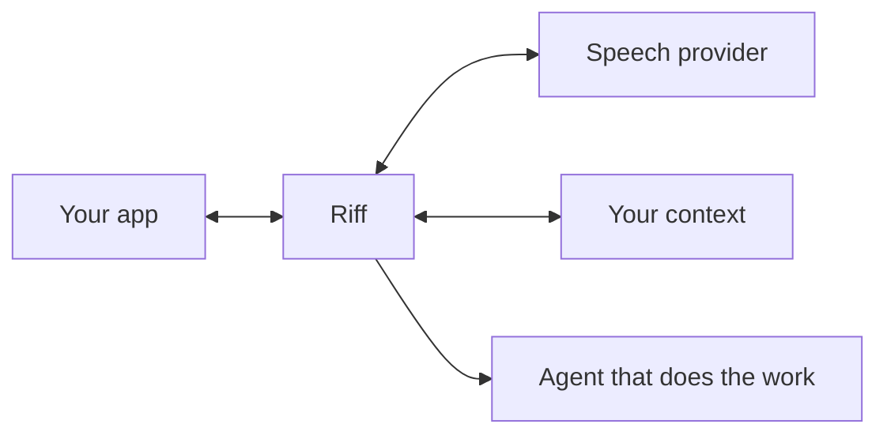

# Riff

Riff is a voice agent that turns thinking out loud into a finished prompt for another agent — in the speaker's own words, ready to send without proofreading or editing.

You talk. Riff listens, asks only the questions that matter, resolves the things you pointed at instead of naming, and assembles a prompt from sentences you actually said. When you say "send it," it goes.

---

## The problem

Prompts are now among the highest-leverage things a developer produces, but typing is slow and today's voice workflow only trades it for another chore: dictate a monologue, repair the load-bearing names speech recognition missed, restructure speech into prose, fetch every PR or document reference, and repeat the instructions that apply every time. The downstream agent cannot clarify any of it until after the prompt is sent.

The tempting shortcut makes the deeper problem worse. Asking a model to "clean up" the transcript removes hedges, emphasis, and the speaker's specific words. The result reads better but can mean something different — and fails silently because the person stopped reading it.

<details>
<summary><strong>Why ordinary dictation isn't enough</strong></summary>

- **Editing gives back the speed.** Spoken thoughts include filler, false starts, and ideas that arrive out of order. Turning a monologue into a usable prompt still means proofreading and restructuring it; Riff's [grounding rules](docs/grounding.md#what-counts-as-an-allowed-edit) remove the cleanup without rewriting the speaker.
- **Recognition misses the load-bearing nouns.** Product names, repositories, services, acronyms, and colleagues' names are exactly what a technical request cannot afford to get wrong. Riff combines a learned lexicon with [term lookup](docs/host-bridge.md#lookupterm) instead of making the speaker repair "get hub," "flake guard," or "sequel."
- **Fetching context breaks the train of thought.** People naturally say "the PR I just opened" or "the doc from Monday." [Reference resolution](docs/host-bridge.md#resolvereference) finds the concrete item while preserving the phrase they actually used.
- **Standing instructions should not be retyped.** Rules such as "don't touch the generated files" recur across prompts and are easiest to forget when they matter. Riff saves them as motifs in the speaker's own words and [reattaches them with their provenance intact](docs/prompt-artifact.md#sections).
- **Prompting is not one-shot.** Ideas branch, pause, and resume. A session can hold [multiple takes](docs/architecture.md#takes), parking one unfinished prompt while the speaker works on another.

</details>

## What Riff does instead

This is the conversation the [runnable demo](examples/riff-web/README.md) plays. Its host supplies sample Slack, past-session, and GitHub results; the ledger, grounding check, and prompt below are real.

> **You** — okay, I think we should make drafts work offline. people keep losing edits on the train.
>
> **You** — the Slack thread from Monday has the examples
>
> **Riff** — *(finds the thread and attaches its link without interrupting)*
>
> **You** — didn't I already riff on this last week?
>
> **Riff** — The local-drafts session or the sync-retry one?
>
> **You** — use the local-drafts session as background, and use the PR I just opened as the starting point. no sync engine yet.
>
> **You** — oh, separate thing, the onboarding doc still says node sixteen. different thing entirely.
>
> **Riff** — *(parks the offline-drafts prompt; opens a separate take for the doc)*
>
> **You** — let's finish the offline drafts one first
>
> **You** — and don't touch the generated files, you know how it is
>
> **You** — I should be able to close the app offline and come back to my edits. send it.

What gets submitted:

```markdown
# Make drafts work offline

I think we should make drafts work offline.

people keep losing edits on the train. the Slack thread from Monday has the examples. use the local-drafts session as background. use the PR I just opened as the starting point.

**Constraints**
- no sync engine yet
- don't touch the generated files

**Done when**
- I should be able to close the app offline and come back to my edits

**Context**
- Slack #feedback "Drafts lost on the train" — https://example.com/slack/offline-drafts — referred to as "the Slack thread from Monday"
- session-local-drafts "Local drafts" — https://example.com/sessions/local-drafts — referred to as "the local-drafts session"
- acme/web#412 "Save drafts locally" (open) — https://github.com/acme/web/pull/412 — referred to as "the PR I just opened"
```

You never stopped to find the Slack link, reconstruct last week's two attempts, or fetch the PR. Riff kept "I think," asked only which earlier session you meant, and reattached your saved constraint verbatim. The onboarding tangent is still parked as its own prompt. Nothing from Slack or the recalled prompts is passed off as something you said.

Run it with `npm run demo` after the setup below. The demo also shows an invented paraphrase being rejected before your words go into the draft. Scripted mode always uses sample data and sends nothing outside the demo; real sources come from your app's [host bridge](docs/host-bridge.md), not built-in Slack or session-history connectors.

## How "their words" is enforced

Riff does not trust a model to preserve someone's voice; it enforces it. Every candidate body line is scored against an append-and-revise ledger of completed transcripts and typed input. Lines that fall below the configured grounding threshold are rejected before they reach the draft. Every artifact carries a fidelity score, and swapping models does not weaken the guarantee.

<details>
<summary><strong>How the grounding check works</strong></summary>

After known transcription corrections are normalized, an order-sensitive longest-common-subsequence comparison scores how many of a candidate line's meaningful words appear in the same order in the ledger. Filler and a configured set of connective words do not count toward the score; the remaining words must meet the configured threshold (0.82 by default). When a line falls short, the model is shown its unmatched words so it can use the speaker's words or ask.

See [docs/grounding.md](docs/grounding.md) for the algorithm and its edge cases.

</details>

## Goals

- **Faithful.** The prompt body is the speaker's words. Fidelity is measured, not asserted.
- **Finished.** The output is submittable as-is. No proofread step, no edit step.
- **Out of the way.** Riff asks only when the answer changes what the downstream agent does, and
  gives feedback only when asked.
- **Resolved.** References, links, prior prompts, and domain vocabulary are looked up during the
  conversation rather than left for the downstream agent.
- **Interruptible.** Backtracking, corrections, tangents, and talking over the agent are normal
  input, not error cases.
- **Portable.** One shared agent definition, one shared engine contract, native bindings per
  platform, and a conformance suite that proves they agree.

## Non-goals

- **Riff does not do the work.** It never proposes an implementation, a design, a library, a file to
  change, or a sequence of steps, and it will not write code. That belongs to the agent downstream.
  This boundary is the difference between a prompting tool and a second, worse coding agent.
- **Riff does not improve your prompt.** It will not make you sound more professional, more
  technical, or more concise. It captures; it does not edit.
- **Riff is not a chat interface.** It has no opinion on your idea and does not want to discuss it.
- **Riff does not decide when to send.** There is no auto-submit, and the configuration that would
  enable one is rejected at load time.
- **Riff is not an app.** It is a library, embedded into applications that supply the microphone,
  the screen, and the world it looks things up in.

## Architecture

At a glance, Riff sits between the application where someone speaks, the services that provide speech and context, and the agent that ultimately does the work.



Your app owns the microphone and interface. Riff listens, clarifies, grounds, and drafts; the finished prompt goes to the downstream agent only when the speaker says to send it.

<details>
<summary><strong>Architecture and core concepts</strong></summary>

**`RealtimeProvider`** moves audio, reports what was heard, and relays tool calls without exposing a provider's wire format to the engine.

**`RiffHost`** resolves world-shaped context — references, terms, prior prompts, and destinations — without putting that context into the speaker's ledger.

The portable core holds the **utterance ledger**, **grounding check**, multiple drafts called **takes**, and the finished **prompt artifact**. **Motifs** preserve reusable instructions in the speaker's own words; the **lexicon** supplies domain vocabulary and transcription corrections. Each platform implements this layer natively against the same conformance suite.

The shared agent definition lives in [`core/agent`](core/agent) and compiles to one bundle every binding loads, so behavior changes happen once in Markdown and JSON rather than in TypeScript, Swift, and Rust separately. The artifact schema is [`prompt-artifact.schema.json`](core/schema/prompt-artifact.schema.json).

See [docs/architecture.md](docs/architecture.md) for the full design.

</details>

## Repository layout

```
core/
  agent/           the shared agent: instructions, tool contracts, session defaults, seed lexicon
  schema/          JSON Schema for the manifest and the prompt artifact
  conformance/     cases every binding must reproduce, as data
  dist/            compiled agent bundle (generated, committed)
packages/
  riff-core/            engine: ledger, grounding, drafts, tools, session
  riff-openai-realtime/ OpenAI Realtime provider (WebSocket and WebRTC)
  riff-github/          GitHub-backed host: resolves PRs, issues, commits, people
swift/
  Sources/RiffCore/            the same engine, natively
  Sources/RiffOpenAIRealtime/  the same provider, over URLSessionWebSocketTask
  Sources/RiffAudio/           capture and playback, including the echo cancellation setup
rust/
  riff-core/               the same engine again, with no dependencies at all
  riff-openai-realtime/    the same provider, over a socket the embedder supplies
tools/
  build-bundle.mjs   compiles core/agent into the bundle each binding ships
examples/
  riff-web/          a browser demo: microphone, live draft, grounding on screen, and a send
docs/
```

## Getting started

The fastest way to see what this does is to run the demo, which needs no API key:

```bash
npm install && npm run build
npm run demo                     # http://localhost:4173
```

It replays the conversation above through the real engine and shows the draft assembling itself line by line, the source lookups, and the paraphrase being rejected. Click **keys** in the page to add an OpenAI key for live mic mode and, optionally, a GitHub token for real repository references in that mode. Scripted mode stays self-contained even when keys are configured. See [the demo README](examples/riff-web/README.md).

### TypeScript

```bash
npm install
npm run build
npm test
```

```ts
import { loadBundle, RiffSession } from "@riff/core";
import { OpenAIRealtimeProvider, clientSecretCredentials } from "@riff/openai-realtime";
import { GitHubHost, issueDestination } from "@riff/github";
import bundleJson from "./core/dist/riff-agent.bundle.json" with { type: "json" };

const session = new RiffSession({
  bundle: loadBundle(bundleJson),
  provider: new OpenAIRealtimeProvider({
    // Your backend mints this. A long-lived API key never reaches a client.
    credentials: clientSecretCredentials(() => fetch("/api/riff/token").then((r) => r.json())),
  }),
  host: new GitHubHost({
    token: process.env.GITHUB_TOKEN!,
    repository: "acme/web",
    destinations: [issueDestination({ repository: "acme/web", default: true })],
  }),
});

session.on((event) => {
  if (event.type === "agent.audio") speaker.play(event.audio);
  if (event.type === "draft") ui.showDraft(event.gist, event.fidelity);
  if (event.type === "submitted") ui.confirm(event.artifact);
});

await session.start();
microphone.on("chunk", (pcm) => session.sendAudio(pcm));
```

### Swift

```bash
swift test --package-path swift
```

```swift
import RiffCore
import RiffOpenAIRealtime
import RiffAudio

let session = RiffSession(
    bundle: try AgentBundle.bundled(),
    provider: OpenAIRealtimeProvider(
        credentials: .clientSecret { try await backend.mintRiffToken() }
    ),
    host: myHost
)

let audio = RiffAudioEngine()
audio.onCapture = { pcm in Task { @MainActor in session.send(audio: pcm) } }

try await session.start()
try audio.start()

for await event in session.events {
    switch event {
    case .agentAudio(let pcm): audio.play(pcm)
    case .interrupted: audio.flushPlayback()
    case .draft(_, let ready, let fidelity, let gist): ui.show(gist, ready, fidelity)
    case .submitted(let artifact): ui.confirm(artifact)
    default: break
    }
}
```

Hold a strong reference to the session for as long as it is connected. Releasing it tears the
connection down, by design — a half-live session with an open microphone is worse than a closed one.

### Rust

```bash
cargo test --manifest-path rust/Cargo.toml
```

```rust
let bundle = Arc::new(AgentBundle::bundled()?);
let mut options = RiffSessionOptions::new(bundle, provider);
options.host = Arc::new(my_host);

let mut session = RiffSession::new(options);
session.on(Box::new(|event| match event {
    RiffEvent::AgentAudio(pcm) => speaker.play(pcm),
    RiffEvent::Draft { gist, ready, fidelity, .. } => ui.show(gist, *ready, *fidelity),
    RiffEvent::Submitted(artifact) => ui.confirm(artifact),
    _ => {}
}));

session.start().await?;
session.run().await;
```

Neither crate has a third-party dependency, and neither brings an async runtime. The socket, the
microphone, and the executor are all yours — see [rust/README.md](rust/README.md).

## Testing

```bash
npm test                             # 126 tests: engine, provider, host, conformance
swift test --package-path swift      # the same conformance suite, natively
cargo test --manifest-path rust/Cargo.toml   # and again, natively
```

The conformance cases in [`core/conformance`](core/conformance) are data, not code, and all three
implementations execute them. They pin the behavior that has to be identical everywhere: which lines
are grounded and which are rejected, and the exact bytes a finished prompt renders to. A prompt
captured on a phone and one captured at a desk are held to the same standard and come out the same.

`npm test` also fails if the committed agent bundle has drifted from `core/agent`, so the definition
Swift and Rust ship can never fall behind the one TypeScript ships.

See [docs/conformance.md](docs/conformance.md) for how to add a binding.

## Security and privacy

- **No long-lived credential on a client.** Devices connect with ephemeral secrets minted by your
  backend. `mintClientSecret` is the only part of the provider that must stay server-side.
- **Audio is not persisted.** Riff keeps transcripts, because the prompt is built from them; it does
  not keep the recording.
- **Credentials are stripped from transcripts** before anything is stored — tokens and API keys that
  arrive through typed input never reach the ledger, the draft, or the model.
- **Nothing is fetched that was not referred to.** Riff resolves references through the host and
  records links; it does not crawl.

Details and the threat model in [docs/security.md](docs/security.md).

## Documentation

| | |
|---|---|
| [Agent design](docs/agent-design.md) | The behavioral contract, and why each rule is there |
| [Architecture](docs/architecture.md) | Layers, session lifecycle, data flow |
| [Grounding](docs/grounding.md) | How "their words" is enforced, and where the edges are |
| [Prompt artifact](docs/prompt-artifact.md) | The output contract and its provenance |
| [Host bridge](docs/host-bridge.md) | Implementing a host for your world |
| [Providers](docs/providers.md) | The provider interface, OpenAI mapping, swapping engines |
| [Conformance](docs/conformance.md) | The shared suite, and adding a platform binding |
| [Security](docs/security.md) | Credentials, redaction, data handling |

## License

MIT. See [LICENSE](LICENSE).
