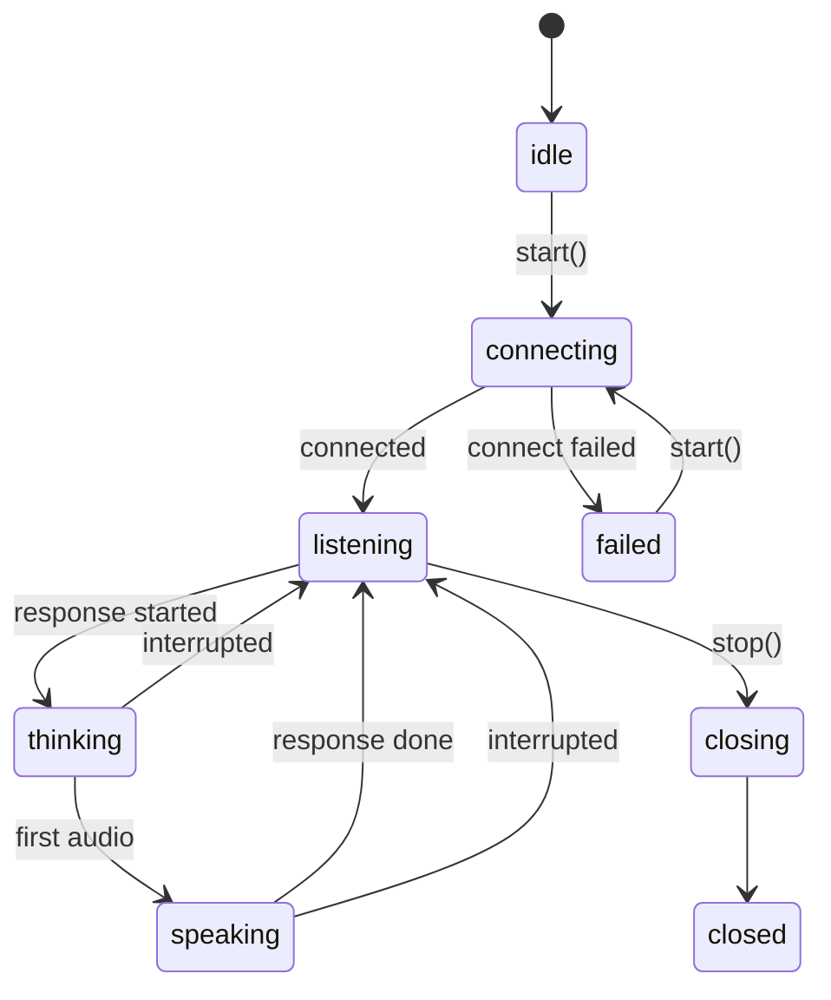
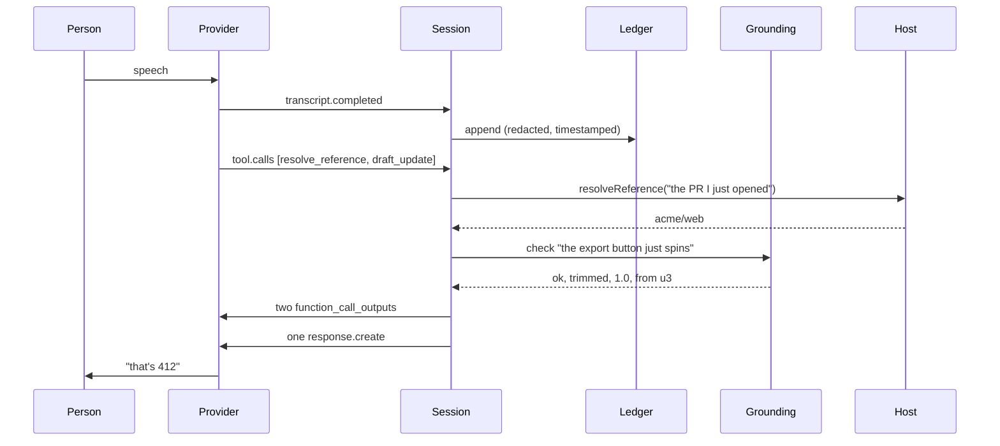

# Architecture

## Layers

```
Embedding application        microphone, playback, screen, credentials
        │
        ├── RiffHost         what the world contains  ──────────┐
        │                                                        │
Riff engine                  ledger, grounding, drafts, artifact │
        │                                                        │
        └── RealtimeProvider  what produces speech ──────────────┘
```

Two interfaces bracket the engine, and neither one leaks into it.

**Below**, `RealtimeProvider` is everything that turns speech into speech: move audio, report what
was heard, relay tool calls. It is the only place any provider's wire format appears. Swapping
OpenAI Realtime for another engine changes nothing a speaker can observe.

**Beside**, `RiffHost` is everything world-shaped: what "the PR I just opened" refers to, what an
acronym means here, what was asked for last week, where a finished prompt goes. Riff knows how to
keep a prompt in someone's voice; it does not know what their world contains. This is what lets the
same agent work in an editor, a terminal, a phone, and a design tool.

**Between** sits the part that is genuinely Riff, and the part that must behave identically
everywhere:

| Component | Responsibility |
|---|---|
| `UtteranceLedger` | Everything said, in order. The only source the prompt body may draw from. |
| `Lexicon` | Vocabulary transcription mangles, and the corrections. Feeds biasing and matching. |
| `GroundingChecker` | Decides whether a proposed line is made of the speaker's words. |
| `Take` / `DraftBook` | Drafts in progress, their ordering, supersession, and attached context. |
| `ToolRegistry` | Validates arguments, runs local tools, delegates host tools. |
| Renderer | Turns a take into the exact bytes the downstream agent receives. |
| `RiffSession` | Owns the lifecycle, the state machine, and turn handling. |

## The shared agent definition

Instructions, tool contracts, session defaults, and the seed lexicon live in `core/agent` as
markdown and JSON, and compile to one bundle every binding loads. Behavior changes are edits to data
files, not parallel edits to TypeScript, Swift, and Rust.

The bundle is generated and committed. Swift, Rust, and any future binding can build without a Node
toolchain, and `npm test` fails if the committed copy has drifted from source, so no binding can
quietly ship a different agent.

Both `loadBundle` implementations validate on load and refuse a bundle that would let the agent drift
from its contract — an out-of-range grounding threshold, an undefined render profile, and in
particular `autoSubmit` set to true.

## Session lifecycle



`start()` does five things in order: loads persisted lexicon terms and motifs from the store, asks
the host for its environment and folds in workspace vocabulary, builds the tool runtime, connects
the provider with the composed instructions and compiled vocabulary, and injects ambient
environment facts.

That last step matters and is easy to get wrong. Environment facts — repository, branch, speaker,
destinations, recently touched items — are sent to the model **but not to the ledger**. They exist so
the agent does not have to ask "which repo?", and because they are not in the ledger, the grounding
check will reject any attempt to quote them as though the speaker had said them. The injected note
says as much explicitly.

## A turn, end to end



Two details in there are load-bearing.

**Tool calls arrive as a batch, one per model turn.** Providers deliver a turn's calls together —
OpenAI in `response.done`, and the neutral event mirrors that with `tool.calls`. Riff runs them all,
returns every result, then asks for exactly one continuation. Asking once per call instead produces
one spoken reply per tool, which sounds like the agent stuttering. Modeling the batch explicitly
also removes any dependence on event-delivery ordering, which differs between an event emitter and
an async sequence.

**Nothing reaches the ledger except completed transcripts and typed input.** Not environment notes,
not tool results, not anything the model says. That single-entrance rule is what makes the grounding
guarantee hold.

## Takes

A session holds several drafts. Changing subject parks the current one rather than destroying it,
and it can be resumed later. Lines within a section are ordered by fractional index so a line can be
inserted between two others without renumbering.

Corrections **supersede**: the replaced line leaves the draft but stays in `history()`, so a change
of mind can be walked back and the shape of the conversation stays auditable.

## Concurrency

**TypeScript.** Single-threaded and event-driven. Tool batches run with `Promise.all`; a
`toolsInFlight` flag keeps the state machine from returning to `listening` mid-dispatch. The flag is
set when the batch arrives and cleared when the continuation response starts, so it does not depend
on whether provider events are delivered while the dispatch is still running — which is exactly
where the two implementations diverge if it is scoped to the dispatch instead.

**Swift.** The same flag lifecycle applies, and it matters more here: the event pump awaits each
handler to completion, so a flag scoped to the dispatch would already be cleared by the time the
turn's `response.done` was read. `RiffSession` is `@MainActor`, which is where a UI-facing conversation object belongs and
which removes a whole class of races by construction. The provider event pump is a single task
draining an `AsyncStream`, so events are handled in order. `Lexicon` and `UtteranceLedger` are
lock-guarded because audio and transcription touch them from other threads. The pump holds a weak
reference to the session and closes the connection if the session is released, so a dropped session
tears down rather than lingering half-alive with an open microphone. `stop()` deliberately does not
finish the session's event stream, because `start()` permits a restart and a finished stream would
leave a reconnected session emitting nothing; `.closed` is the signal for a consumer to stop
iterating, and the stream ends when the session is released.

**Rust.** The same flag lifecycle again, and for the same reason as Swift: `step()` awaits the tool
batch, so a flag scoped to the dispatch would be clear before the turn's `response.done` was read.
There is no runtime and no spawning. `RiffSession` is an ordinary `&mut self` object, which makes the
races the other bindings guard against unrepresentable — the engine's state has one owner, and the
borrow checker enforces it. Events go out through listeners rather than a stream, because a listener
needs nothing from the executor. Provider events arrive by pull: `RealtimeConnection::next_event`
is a future the session awaits in a loop, and the loop races it against `Clock::sleep` so an expiry
warning still fires in a session that has gone quiet. Tools mutate state and return a list of
effects, which the session then turns into events, so nothing calls back into the session while it
holds a borrow of itself.

## Error handling

Provider errors carry a `retryable` flag. A rejected session configuration will be rejected again
and moves the session to `failed`; a transport fault will not and stays recoverable. The handshake
has a timeout and surfaces a rejection as a connect error rather than waiting it out.

Tool failures are values, not exceptions: an invalid argument or a handler error becomes a structured
result the model reads and retries. A malformed tool call should cost one turn, not the
conversation.

Sessions have a provider-imposed maximum duration. Riff emits `expiring` events at five minutes and
one minute remaining so the application can warn or hand off, rather than having the connection
vanish mid-sentence.
